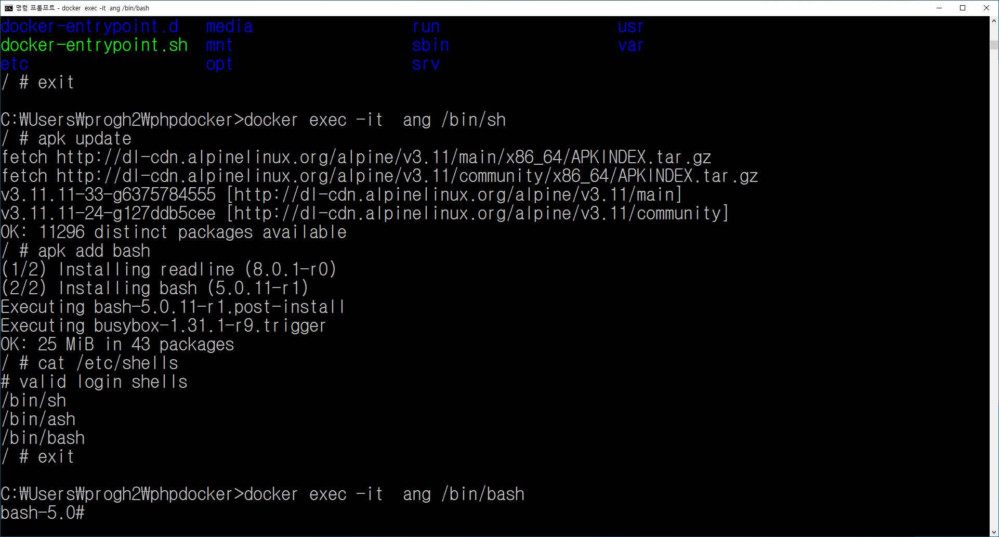
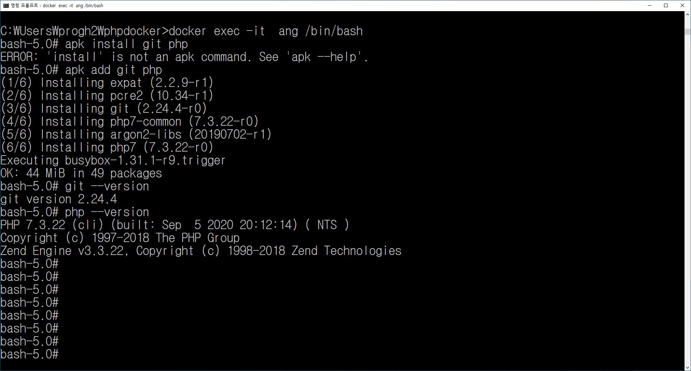
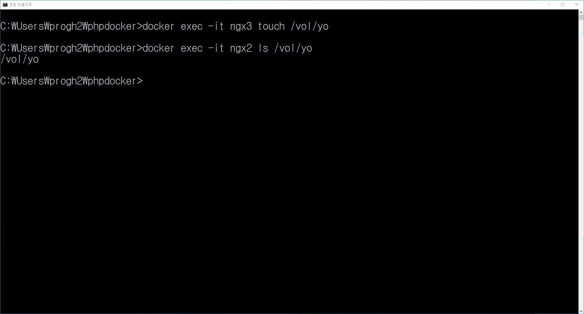
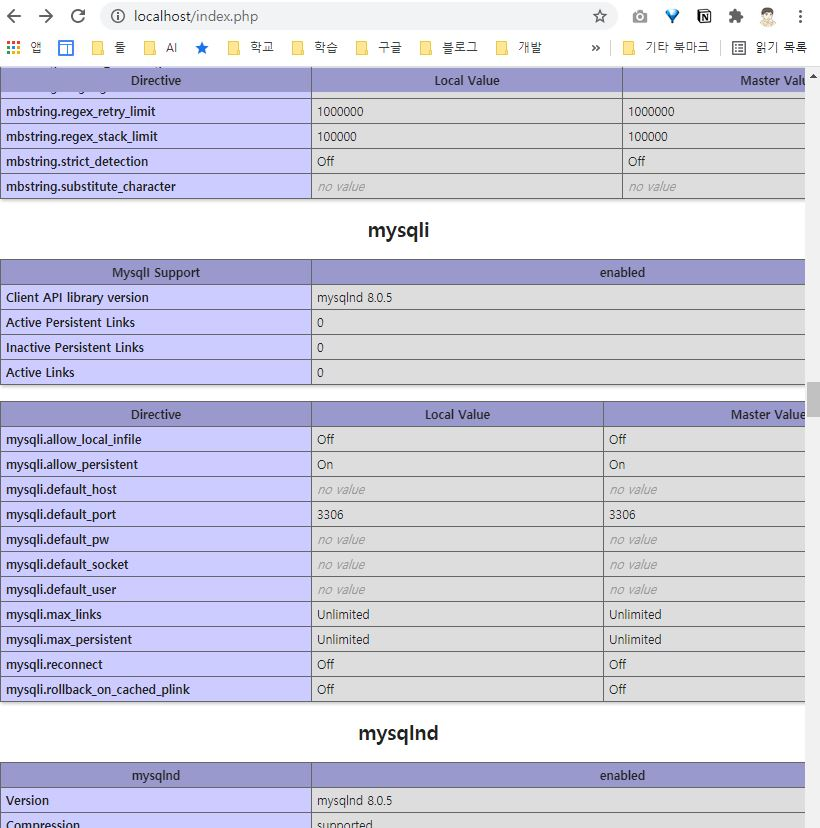
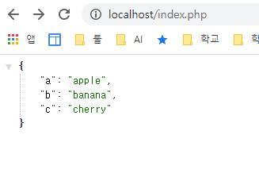
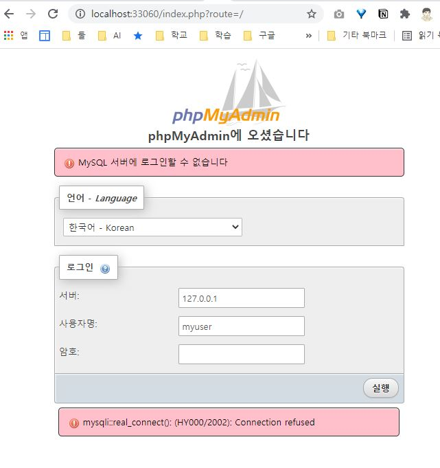

# `함기훈`의 공간 

## 미션 수행
1. [미션1](#미션1)
1. [미션2](#미션2)
1. [미션2a](#미션2a)
1. [미션3](#미션3)
1. [TODO](#TODO)

### 미션1

### 미션2

### 미션2a

### 미션3
phpinfo() 띄우기

php로 json 출력

## TODO
phpmyadmin 접속 불가 - 소켓 설정을 php.ini에 수동으로 해줄 필요가 있음(TODO)

Flutter에 dio 라이브러리를 써서 rest api get 연동, 출력해보기 

